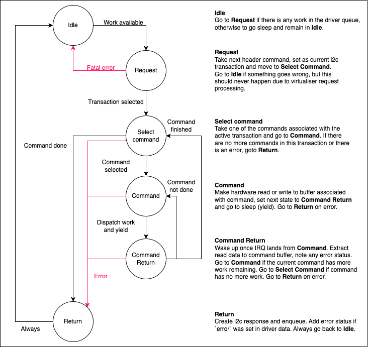

<!--
    Copyright 2025, UNSW
    SPDX-License-Identifier: BSD-2-Clause
-->

# I²C sub-system

sDDF has support for I²C host controllers and interfaces for a small number of
peripherals.

For a list of the supported host controllers, see
[../drivers.md](../drivers.md).

## I²C

I²C (inter-integrated-circuit) is a two-wire synchronous serial bus used for
interfacing between chips. The bus architecture consists of some number of
**controllers** which control **targets** (peripherals).

Only one controller may use the bus at any time, and if two controllers attempt
to write at once they perform a bus arbitration process.

All targets have a **bus address** which is typically 7 bits (although longer
addresses are possible in some variants). A controller can start a transaction
by sending a start bit followed by an address. The final bit of the address
specifies if the operation is a read.

On every rising edge of the clock after the start and address, the controller
will write a bit or read a bit until there is no more data available. The
controller sends a STOP condition to indicate it is done writing, or the target
send a NACK to indicate no more data can be read.

### Common variations

#### Repeated start conditions

An extra start bit can be injected between reads or writes to allow a long chain
of operations. This avoids the time required to send a stop and resend the
target address.

#### Device registers

I²C commonly is used to index into registers in a target. The protocol itself
provides no mechanism to do so, but a commonly implemented pattern is to write
the 8-bit address of a target register after writing the 7-bit bus address.

For reads we first perform a WRITE operation with the register address, then
immediately perform a READ operation as normal. This leads to the following
series of operations on the bus:

```
START | ADDRESS (write) | (register address) | START | ADDRESS (read) | ... (read ops) | STOP
```

For writes we simply inject the register address as the first byte of the write
operation, with bus operations as follows:

```
START | ADDRESS (write) | (register address) | ... (write ops) | STOP
```

We refer to the process of performing a read to a register as a "write read" in
our source code.

## Protocol

The I²C protocol abstracts I²C transactions into a series of *commands*.

A command is a single operation on a buffer, encapsulating the requirement to
read or write and a set of control flags specifying how start and stop
conditions are generated.

An I²C transaction is a series of commands that must occur on the bus in a batch
such that the controller cannot inject any work in-between. The notion of
atomicity within a transaction is very important for interfacing with many
peripherals.

To allow for atomicity, we specify that every transaction must begin with a
**header command** which specifies the I²C bus address and number of commands in
the transaction. The next N commands (as specified by the header) will be
considered a part of the request.

A command is represented by the type `i2c_cmd_t` in `i2c/queue.h` as a tagged
union, using the same struct for the header and body commands.

```c
typedef struct i2c_cmd {
    union {
        /* Location of read destination / write data in data region */
        /* If a writeread operation, assumed that first byte of buffer contains sub address of byte register */
        uint8_t *data;

        /* Fields for header members */
        struct {
            uint16_t batch_len;
            i2c_addr_t address;
        } i2c_header;
    } payload;
    /* Size of read/write operation. Max 256 back-to-back reads / 64KiB write */
    /* Unused if this is a header command */
    uint8_t data_len;
    i2c_cmd_flags_t flag_mask;
} i2c_cmd_t;
```

There are only a few features of commands that are notable at a top level:
* If the command is a header, the data pointer is replaced with the batch length
  and bus address.
* The data pointer is a pointer in the virtual address space of the client until
  the virt translates it.
* Write-reads are enabled with a special flag. If a write-read is enqueued, it
  is assumed that the first byte of the data buffer contains the address.
* The flag mask allows a command to specified repeated start conditions,
  write-reads, stop conditions, etc.
* The union is tagged by the bit corresponding to the header flag in the flag
  mask.

### Clients

Clients interface with the I²C virtualiser via a **request** and **response**
queue. These are simple first-in, first-out buffers containing commands for
requests and bespoke response structs in the response queue. Responses simply
indicate an error value and the number of bytes read/written.

The request queue uses a "committal" behaviour when enqueueing. Each command
enqueued doesn't increase the length of the queue until a client "commits" their
changes, ensuring that entire transactions appear in the queue at once. This
prevents race conditions in multi-core environments.

Clients can either manually compose a request by starting with a header and
following it with commands or use **libi2c** to compose simple requests. The
client must ensure data buffers are within the data shared region (as supplied
in the config structs). After a request is enqueued and committed, the client
must use a Microkit notification to alert the virtualiser that work is
available. The client is expected to await another notification from the
virtualiser indicating that a response is available.

### libi2c

libi2c provides a simple interface to perform blocking I²C operations using
coroutines to manage concurrency. It supports `libco` and `libmicrokitco`
coroutines, defaulting to `libmicrokitco` unless `LIBI2C_RAW` is defined at
compile time. As with all I²C commands, data buffers supplied to the libi2c
functions must be in the data region or an error code will be returned.

The user can copy data from any buffer into the data region if required,
although we omit this functionality to prevent interference with more complex
usage of the data region.

### Virtualiser

The I²C virtualiser is responsible for validating that incoming transactions are
well-formed and substituting client pointers with addresses in the driver
address space. The virtualiser validates transactions one command at a time and
only copies them to the driver queue if the entire transaction is valid.

The virtualiser ensures fairness of incoming requests to prevent starvation or
non-monotonic processing of incoming data. Once a client has supplied N commands
of work to the virtualiser, the virtualiser will not perform work for other
clients until those N commands have been processed. Additionally, if the driver
queue cannot fit all commands of a transaction it will be deferred until the
driver has made room.

Hence, the virtualiser performs the following steps on every wake up:
1. Accept returned buffers from driver if the driver signalled it.
2. Check the deferred work queue. Work through all deferred work if possible.
3. Accept new work. If any deferred work wasn't completed or this work cannot
   fit in the driver queue, also defer it.

### Driver



The I²C driver is implemented as a finite state machine (FSM) using a generic
structure.

The FSM has six states:
1. Idle: await work.
2. Request: ingest an incoming request.
3. Select command: choose command within request to operate on.
4. Command: perform reading/writing for command.
5. Command return: wake up from IRQ after command work performed.
6. Return: generate response and notify virtualiser.

The FSM will process all work in the driver queue and go to sleep once finished.
The state machine handles controlled sleeping (e.g. to wait for interrupts) or
to give up once there is no more work to do.

Generic FSM source code can be reused by importing `<i2c/driver.h>`.

## Peripherals

Below is a list of peripherals supported with libraries:

* NXP PN532 card reader.
    * Testing was done with the [PN532 NFC RFID Module
      V3](https://www.nxp.com/docs/en/user-guide/141520.pdf).
    * The code was based an Arduino PN532 library found
      [here](https://github.com/elechouse/PN532/).
* Analog Devices DS3231 RTC.
    * Documentation can be found
      [here](https://www.analog.com/media/en/technical-documentation/data-sheets/ds3231.pdf).
