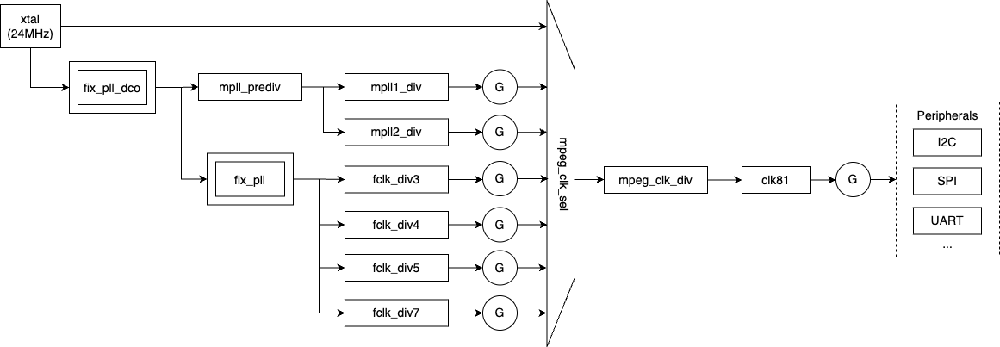

# Clock Driver

## Overview

Each SoC has a tree of gates, multiplexers, dividers, and phase-locked-loops
(PLL) that take external clock inputs (e.g., from a crystal), and derive
other frequencies from them. A clock driver in an SoC environment is a kernel
component that manages the clock infrastructure for hardware devices in the
system. The clock driver is responsible for providing, controlling, and
configuring clock signals for various peripherals, CPUs, and subsystems. 

The common clock framework (CCF) in Linux was introduced ot address the
growing complexity of clock management in modern SoCs. It abstracts the
features of clock hardware and provides a set of unified interfaces
to allows device drivers to interact with clocks. Clock providers are
hardware blocks that generate and control clocks, such as oscillators,
PLLs, and dividers. Clock consumers are devices or peripherals that require
clock signals to function and can interact with the clock framework via
the exposed interfaces.

We adhere to the CCF and allows the consumers to request and control via a
unified API, which is essentially a remote-procedure call.

Before the clock driver is built, a Python script parses the device tree and
generates a C header file that specifies required clocks and corresponding
rates at compile time. The clock driver must be given a highest priority to
ensure that it is initialised earlier than all potential users in the system.
At `init()` time, the driver initialises the clock tree based on the generated
`clk_conf.h` file which can also be manually modified to specify a clock
frequency.

The below picture gives a sample of how a clock tree looks like:

## Usage

This driver can be used as a clock server to manage and control clock hardware in
a SoC. To initialise the whole clock tree, a DTS file is required to be prepared.

To control the clocks, the following APIs can be invoked at userspace:
- `static inline uint32_t sddf_clk_enable(microkit_channel channel, uint32_t clk_id)`
- `static inline uint32_t sddf_clk_disable(microkit_channel channel, uint32_t clk_id)`
- `static inline uint32_t sddf_clk_get_rate(microkit_channel channel, uint32_t clk_id)`
- `static inline uint32_t sddf_clk_set_rate(microkit_channel channel, uint32_t clk_id, uint32_t rate)`

`clk_id` can be found in the corresponding binding file:
- Odroid-C4: `sddf/drivers/clk/meson/include/g12a-clkc.h`
- iMX8MQ: `sddf/drivers/clk/imx/include/imx8mq.h`

See `include/sddf/clk/client.h` for more details.

## Odroid C4

@terryb FILL IN

## iMX8-*

@terryb FILL IN
